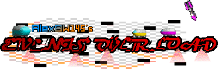

# 
A Baldi's Basics Plus mod that self-inserts four new events into the game, with the introduction of 6 new CRAZY events and 4 new bonus events!

# Contributors
* ### AlexBW145
- Made the mod
- Coded the events in sight
- Also coded the implemention of CRAZY and bonus events
- Made models for UFOs, Spiked Balls, Gnat Houses, and Traffic Trouble Cars.
* ### B-Side Skid (on Gamebanana)
- Traffic Trouble road assets before they were modified.
* ### PixelGuy
- Helped with an information of a transpiler opcode.
* ### MissingTextureMan(/Meow)101
- Suggested Traffic Trouble cars exploding when colliding with frozen NPCs.
- Made the API that this mod is dependent to.
- Made Level Loader and Level Studio, which the mod has compatability with.

# Content Notice
*This mod contains random events that has contents that originated and belonged to different video games and is not responsible for the damage that caused towards Baldi's super schoolhouse.*